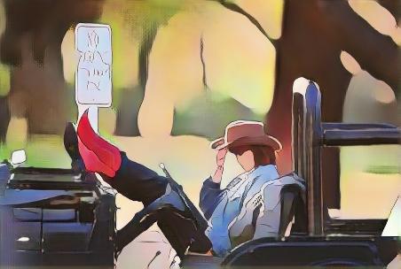

# CartoonGAN Test PyTorch
Updated version of [CartoonGAN-Test-Pytorch-Torch](https://github.com/Yijunmaverick/CartoonGAN-Test-Pytorch-Torch). Removed Lua support and fixed some minor deprecated PyTorch code. 

## Examples (Left: input, Right: output)

<p>
    
    
</p>

<p>
    
    
</p>

<p>
    
    
</p>

## Usage
This code base should work well with the latest versions of PyTorch.
1. Git clone the repository
```
$ git clone https://github.com/rae0924/CartoonGAN-Test-Pytorch
$ cd CartoonGAN-Test-Pytorch
```
2. Download the model state dicts:
for Linux/MacOS:
```
$ sh ./pretrained_model/download_pth.sh
```
for Windows:
```
>  ./pretrained_model/download_pth.bat
```
3. Run test.py with command-line arguments:
```
$ python test.py --input_dir inputImageDir --style CartoonStyle --gpu 0
```
Where `--input_dir` is the path to images, `--style` is the style to transform the images into (ex: `--style Hayao`), and `--gpu` specifies the device to use (ex: `--gpu 0` is GPU and `--gpu -1` is CPU). The outputs will be stored in test_output directory.
